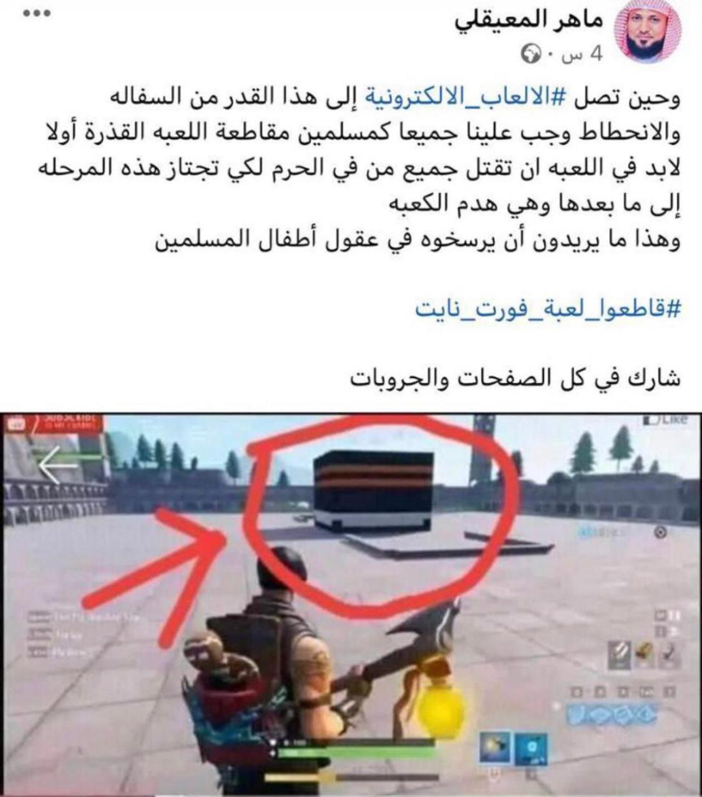

<h1>dank's scripts<h1>

<h1>Scripts i have here</h1>

<a href="https://github.com/DankBladeZS/RobloxScripts/blob/main/GlobalScripts/Invis.lua">Invisible</a> (for r6 and r15)</a>

<a href="https://github.com/DankBladeZS/RobloxScripts/blob/main/GlobalScripts/InsertModel.lua">Model Inserter</a> (clientsided you dumb)</a>

<a href="https://github.com/DankBladeZS/RobloxScripts/blob/main/GlobalScripts/FakeKickLibraryEdited.lua">Fake Kick Library</a> (edited version of frel0/xamel on wearedevs)</a>

<a href="https://github.com/DankBladeZS/RobloxScripts/blob/main/GlobalScripts/Freecam.lua">Freecam</a> (press Shift+P and yes this is the roblox freecam)</a>

